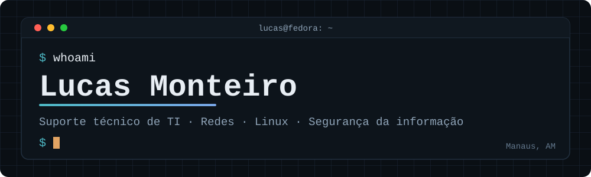

 

 

## ~/sobre-mim

Trabalho com suporte técnico: hardware, instalação e configuração de Windows e
Linux, ingresso em domínio e redes. Estudo redes, Linux, Active Directory e
fundamentos de segurança da informação, praticando em laboratórios próprios com
máquinas virtuais.

 

## ~/stack

**No dia a dia**

**Estudando**

Meu ambiente de laboratório

 

- **Host:** Fedora (GNOME)
- **Virtualização:** GNOME Boxes (QEMU/KVM)
- **Servidor de testes:** Ubuntu Server em máquina virtual

 

## ~/projetos

### 🖥️ Laboratório de Service Desk com GLPI

Estou montando um sistema de chamados (GLPI) do zero numa VM Ubuntu Server,
sobre Apache, PHP e MariaDB, com categorias, prioridades e chamados de teste
simulando um dia real de suporte.

**Por que estou fazendo:** para ter experiência prática com um sistema de
service desk de verdade, já que no meu trabalho o atendimento ainda é feito por
WhatsApp.

**Desafio até agora:** depois de instalar tudo, o host não conseguia se conectar
à VM por SSH. Investigando camada por camada (firewall da VM, rede do Fedora,
políticas do `firewalld`), encontrei uma regra específica bloqueando o tráfego
entre as duas zonas e corrigi sem precisar recriar nada.

`📁 laboratorio-glpi-service-desk` — repositório publicado em breve, com README,
prints e o passo a passo completo.

 

### 🧾 Sistema de Chamados Próprio

Estou construindo minha própria versão, pequena, de um sistema de chamados: API,
banco de dados e tela, rodando na mesma VM do laboratório acima.

**Por que estou fazendo:** para entender a viagem completa de um pedido web
(cliente, API e banco) construindo do zero, não só usando um sistema pronto.

`📁 sistema-de-chamados` — repositório publicado em breve, conforme cada parte
(banco, API, tela) for ficando pronta.

 

## ~/contato

 

Este perfil é atualizado conforme concluo cada laboratório.

